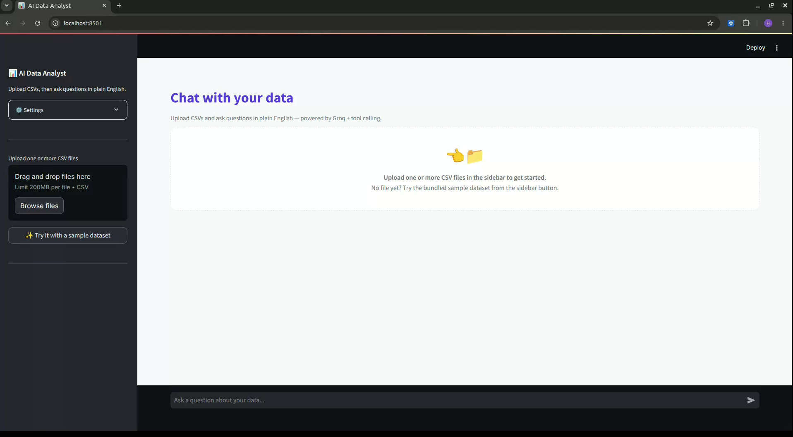
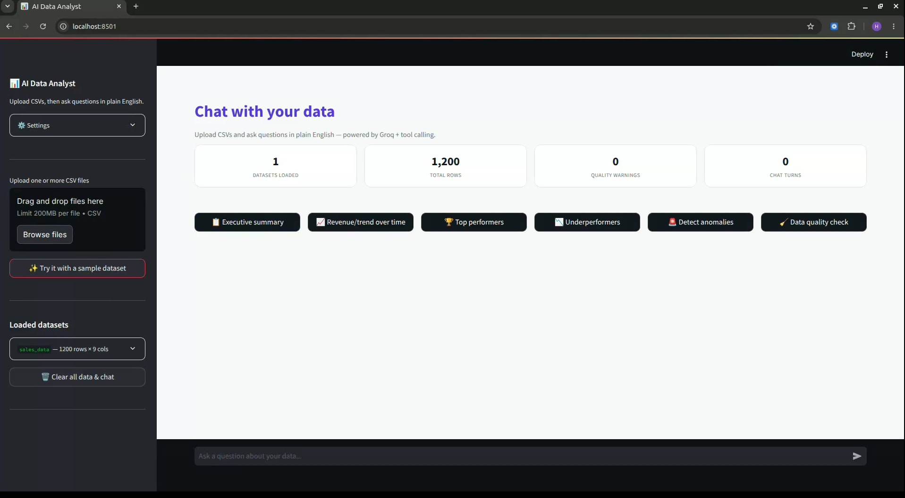
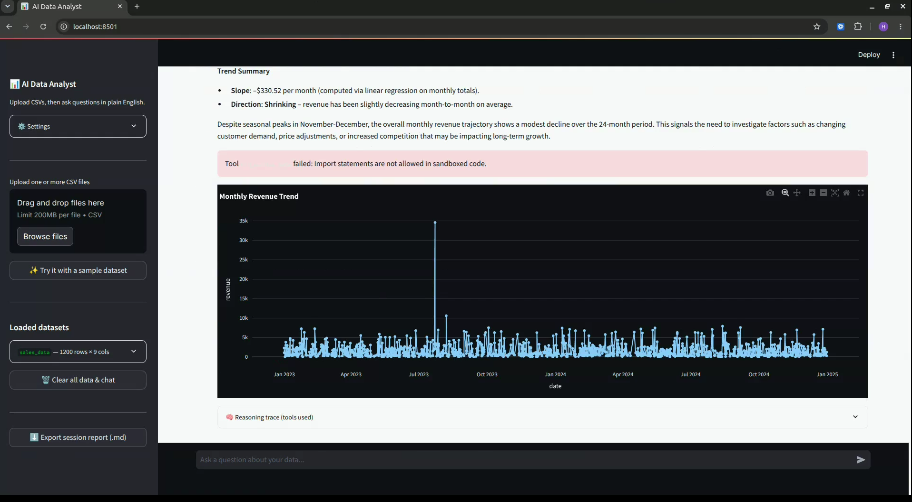
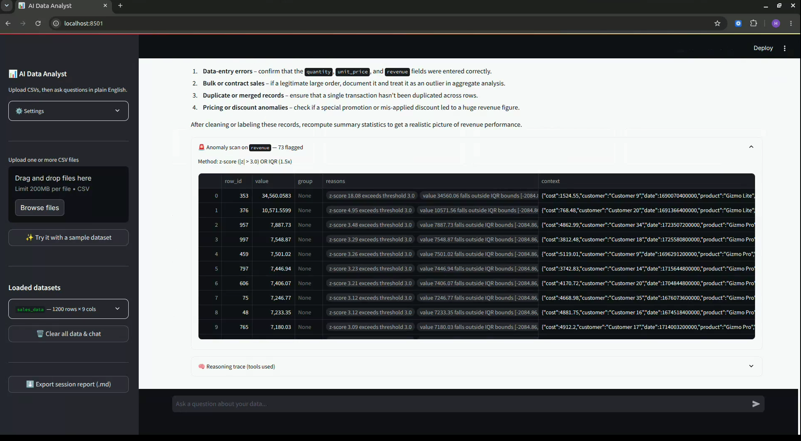

# 📊 AI-Powered Data Analyst

An AI-powered data analyst that allows users to upload CSV files and interact with their data using plain English. Simply upload your dataset, ask questions, generate charts, run SQL or Pandas analysis, detect anomalies, and receive clear business insights—all without writing code.

This project was built for the **Digital Back Office AI Engineer Assignment**.

---

# ✨ Features

* 📂 Upload one or more CSV files
* 💬 Ask questions in natural language
* 🐼 AI-generated Pandas analysis
* 🗄️ AI-generated SQL queries using DuckDB
* 📊 Interactive charts (Bar, Line, Pie, Scatter, Histogram, Box)
* 🚨 Detect anomalies using statistical methods
* 📈 Automatic dataset profiling and summary
* 🔄 Supports follow-up questions with conversation history
* 📄 Export chat session as a Markdown report
* ⚡ Fast AI-powered analysis using Groq LLM

---

# 🏗️ Architecture


### Workflow

```
                User
                  │
                  ▼
          Streamlit Web App
                  │
                  ▼
              Groq LLM
                  │
                  ▼
          Tool Dispatcher
      ┌─────────┼─────────┐
      │         │         │
      ▼         ▼         ▼
 Pandas      DuckDB    Chart Engine
 Sandbox       SQL      Plotly
      │         │         │
      └─────────┼─────────┘
                │
                ▼
        Final Answer & Charts
```

---

# 🖼️ Screenshots

## Home Page



---

## Chat with Dataset



---

## Generated Charts



---

## Anomaly Detection



---

# 🎥 Demo

**Live Application**

> Add your deployment URL here

Example:

```
https://your-app.streamlit.app
```

**Demo Video**

> Add your YouTube or Google Drive link here

Example:

```
https://youtu.be/xxxxxxxx
```

---

# 🛠️ Tech Stack

| Technology | Purpose              |
| ---------- | -------------------- |
| Python     | Backend              |
| Streamlit  | User Interface       |
| Groq API   | Large Language Model |
| Pandas     | Data Analysis        |
| DuckDB     | SQL Query Engine     |
| Plotly     | Interactive Charts   |
| Pytest     | Unit Testing         |
| Docker     | Containerization     |

---

# 📁 Project Structure

```
ai-data-analyst/
│
├── app/
│   ├── main.py
│   ├── config.py
│   ├── core/
│   │   ├── data_manager.py
│   │   ├── llm_client.py
│   │   ├── sandbox.py
│   │   ├── sql_engine.py
│   │   ├── chart_engine.py
│   │   ├── anomaly.py
│   │   ├── tools.py
│   │   └── report_export.py
│   │
│   └── utils/
│       └── logger.py
│
├── sample_data/
│   └── sales_data.csv
│
├── tests/
│
├── docs/
│   ├── architecture.png
│   ├── screenshot1.png
│   ├── screenshot2.png
│   ├── screenshot3.png
│   └── screenshot4.png
│
├── Dockerfile
├── docker-compose.yml
├── requirements.txt
├── README.md
└── .env.example
```

---

# 🚀 Getting Started

## Clone the Repository

```bash
git clone https://github.com/<your-username>/ai-data-analyst.git

cd ai-data-analyst
```

---

## Create a Virtual Environment

### Windows

```bash
python -m venv venv

venv\Scripts\activate
```

### Linux / macOS

```bash
python3 -m venv venv

source venv/bin/activate
```

---

## Install Dependencies

```bash
pip install -r requirements.txt
```

---

## Configure Environment Variables

Create a `.env` file.

```env
GROQ_API_KEY=your_groq_api_key

GROQ_MODEL=openai/gpt-oss-20b

MAX_TOKENS=768

MAX_AGENT_TURNS=3

ENABLE_CACHE=true

LOG_LEVEL=INFO
```

---

## Run the Application

```bash
streamlit run app/main.py
```

Open your browser:

```
http://localhost:8501
```

---

# 🐳 Running with Docker

Build and start the application

```bash
docker compose up --build
```

The application will be available at:

```
http://localhost:8501
```

---

# 📂 Sample Dataset

A sample dataset is included inside

```
sample_data/sales_data.csv
```

You can also upload your own CSV files for analysis.

---

# 💡 Example Questions

Try asking questions such as:

* What is the total revenue?
* Which region generated the highest sales?
* Show monthly sales trends.
* Create a bar chart for revenue by region.
* Which products are underperforming?
* Detect anomalies in the revenue column.
* Generate SQL to find the top 5 customers.
* What are the top-selling products?
* Compare revenue across regions.
* Which customer contributed the highest profit?

---

# ⚙️ Configuration

| Environment Variable | Description                       |
| -------------------- | --------------------------------- |
| GROQ_API_KEY         | Your Groq API Key                 |
| GROQ_MODEL           | LLM model                         |
| MAX_TOKENS           | Maximum response tokens           |
| MAX_AGENT_TURNS      | Maximum reasoning/tool iterations |
| ENABLE_CACHE         | Enable response caching           |
| LOG_LEVEL            | Logging level                     |

---

# 🧪 Running Tests

Install dependencies

```bash
pip install -r requirements.txt
```

Run all tests

```bash
pytest
```

---

# 🔒 Safety Features

* Secure Pandas sandbox
* Read-only SQL execution
* Dangerous Python operations blocked
* Tool-based execution instead of direct code execution
* Structured error handling
* Request logging
* Response caching

---

# 🔮 Future Improvements

* User authentication
* Forecasting and predictive analytics
* Dashboard customization
* Database connectivity
* Cloud storage integration
* Advanced visualizations
* AI-generated dashboard reports

---

# 👨‍💻 Author

**Himasri Pithani**

Built as part of the **Digital Bank Office AI Engineer Assignment**.
